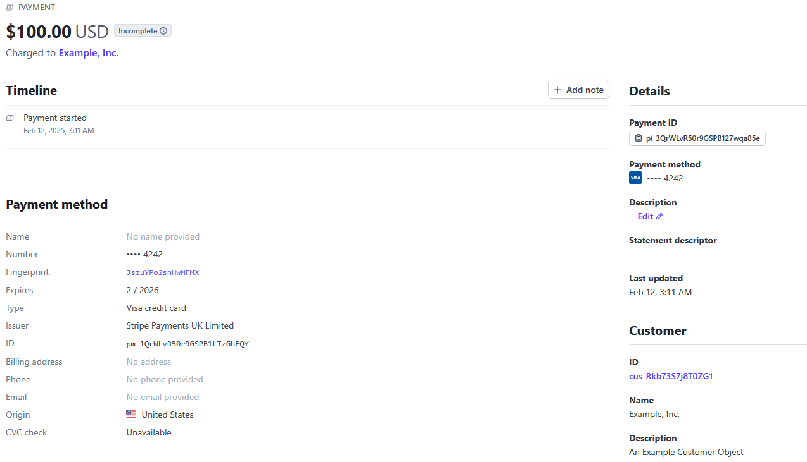

# TAM Interview: Written Project Prompt

- [TAM Interview: Written Project Prompt](#tam-interview-written-project-prompt)
  - [Question 1 | Saving Customer Objects](#question-1--saving-customer-objects)
  - [Question 2 | Auth \& Capture](#question-2--auth--capture)
    - [2a. Use an API call to create an authorization for $100. Provide the Payment Intent ID related to this authorization.](#2a-use-an-api-call-to-create-an-authorization-for-100-provide-the-payment-intent-id-related-to-this-authorization)
    - [2b. Log into your Stripe dashboard (https://dashboard.stripe.com/) and include a screenshot of the payment page for the authorization you just created](#2b-log-into-your-stripe-dashboard-httpsdashboardstripecom-and-include-a-screenshot-of-the-payment-page-for-the-authorization-you-just-created)
    - [2c. Use an API call to create a capture for $75. What happens to a charge if you only capture for a portion of an authorization, and not the full amount?](#2c-use-an-api-call-to-create-a-capture-for-75-what-happens-to-a-charge-if-you-only-capture-for-a-portion-of-an-authorization-and-not-the-full-amount)
    - [2d. How do steps 2a-2c show on the customer’s bank statement?](#2d-how-do-steps-2a-2c-show-on-the-customers-bank-statement)
    - [2e. Name and describe 2 distinct business models/use cases that would require auth and then capture at a later time](#2e-name-and-describe-2-distinct-business-modelsuse-cases-that-would-require-auth-and-then-capture-at-a-later-time)
  - [Question 3 | Stripe Connect](#question-3--stripe-connect)
    - [3a. Create a Custom Connect connected account. Provide the account ID](#3a-create-a-custom-connect-connected-account-provide-the-account-id)
    - [3b. Create a “destination” charge for a Lyft ride in which the rider pays $20 and the driver receives $15. Provide the Payment Intent ID](#3b-create-a-destination-charge-for-a-lyft-ride-in-which-the-rider-pays-20-and-the-driver-receives-15-provide-the-payment-intent-id)
    - [3c. For this ride, how much is Lyft’s platform fee?](#3c-for-this-ride-how-much-is-lyfts-platform-fee)
    - [3d. How much is the Stripe processing fee for this ride?](#3d-how-much-is-the-stripe-processing-fee-for-this-ride)
    - [3e. What are Lyft's net earnings for this ride?](#3e-what-are-lyfts-net-earnings-for-this-ride)
    - [3f. Now, try to have Lyft charge the driver $2 to cover the cost of the neon-lighted Lyft sign that sits in their dashboard. Provide the ID for that request](#3f-now-try-to-have-lyft-charge-the-driver-2-to-cover-the-cost-of-the-neon-lighted-lyft-sign-that-sits-in-their-dashboard-provide-the-id-for-that-request)
    - [3g. Tell us about how you went about solving 3F. What is your API call doing?](#3g-tell-us-about-how-you-went-about-solving-3f-what-is-your-api-call-doing)
    - [3h. Aside from rideshare, name a business or industry that should use Stripe Connect and why](#3h-aside-from-rideshare-name-a-business-or-industry-that-should-use-stripe-connect-and-why)
  - [Question 4 | Responding to Users](#question-4--responding-to-users)


## Question 1 | Saving Customer Objects

Stripe allows you to save credit card details for later. Using an API call, create a customer object leveraging a [Visa test payment method](https://docs.stripe.com/testing?testing-method=payment-methods#visa). For all of the following questions below, you should continue to charge against the same customer object. Provide the customer object ID when this is complete. (example: cus_CDVnj5JnDd6kaf)

Customer Object ID: `cus_Rkb73S7j8T0ZG1`

## Question 2 | Auth & Capture

Stripe allows its users to auth and capture. This is most commonly used by retailers (like Amazon) who authorize your credit card at the time of checkout, but only capture the charge after they have confirmed that their warehouse has the item or once they have shipped the item.

### 2a. Use an API call to create an authorization for $100. Provide the Payment Intent ID related to this authorization.

API Call Used:

```bash
stripe payment_intents create --amount="10000" \
  --currency="usd" \
  --capture-method="manual" \
  --customer="cus_Rkb73S7j8T0ZG1" \
  --payment-method="pm_card_visa"
```

Payment Intent ID: `pi_3QrWLvR50r9GSPB127wqa85e`

### 2b. Log into your Stripe dashboard (https://dashboard.stripe.com/) and include a screenshot of the payment page for the authorization you just created

Screenshot:


### 2c. Use an API call to create a capture for $75. What happens to a charge if you only capture for a portion of an authorization, and not the full amount?

API Calls:

1. Confirm the `PaymentIntent`

```bash
stripe payment_intents confirm pi_3Qr6qmR50r9GSPB10CBVrg7K --capture-method="manual" \
--return-url="https://example.com"
```

2. Caputre the Payment

```bash
stripe payment_intents capture "pi_3Qr6qmR50r9GSPB10CBVrg7K" --amount-to-capture="7500" 
```

When only a portion of an authorization is captured, in this case \$75.00/\$100.00, the other portion of the authorization for the charge is refunded.

### 2d. How do steps 2a-2c show on the customer’s bank statement?

Walking through steps 2a-2c, they show on the customer's banke statement as follows:
2a - When the authorization, in this case a PaymentIntent Object, is created it will show on a customer's bank statement as a pending charge for the amount specificed in the authorization, in this case $100.00.
2b - See screenshots...
2c - When a partial payment capture is completed, the customer's statement may say something along the lines of "Partial Capture", or show a capture for the full amount with a refund for the amount that was not captured.

### 2e. Name and describe 2 distinct business models/use cases that would require auth and then capture at a later time

1. Vacation rentals, such as AirBnB and Vrbo, in which an authorization could be placed at the time of a booking, and then charged later before the stay, and a hold could be placed for the duration of the stay and refunded later for any incidentals or damages.
2. Car Reservations, in which an authorization can be placed to guarantee payment on the day the rental begins, and in the same case as above, a hold can be placed and refunded in the case of any incidentals or damages.

## Question 3 | Stripe Connect

Through our [Connect platform product](https://stripe.com/connect), Stripe enables platforms like Lyft to collect payments from riders and also payout drivers. In Stripe API terminology, a rider is a “customer” and a driver is a “connected account.” There are three different types of Connect accounts. For this question, you will be **making API calls** with [Custom Connect accounts](https://docs.stripe.com/connect/custom-accounts). Use this [Connect test data](https://docs.stripe.com/connect/testing) as needed. Note that while many of these actions can be done using the Dashboard, we ask that you **use the API** to complete the requests.

### 3a. Create a Custom Connect connected account. Provide the account ID

Account ID: `acct_1QrULSQtFrSnMH0Z`

### 3b. Create a “destination” charge for a Lyft ride in which the rider pays $20 and the driver receives $15. Provide the Payment Intent ID

API Call:

```bash
stripe payment_intents create --amount="2000" \
--currency="usd" \
--application-fee-amount="500" \
-d "transfer_data[destination]=acct_1QrULSQtFrSnMH0Z"
```

Payment Intent ID: `pi_3QrWCHR50r9GSPB11WQrSJ8R`

### 3c. For this ride, how much is Lyft’s platform fee?

Platform Fee: `$5.00`

### 3d. How much is the Stripe processing fee for this ride?

Processing Fee: `$0.88`

### 3e. What are Lyft's net earnings for this ride?

Net Earnings: `$19.12`

### 3f. Now, try to have Lyft charge the driver $2 to cover the cost of the neon-lighted Lyft sign that sits in their dashboard. Provide the ID for that request

API Calls used:

1. Create a new `PaymentIntent`

```bash
stripe payment_intents create --amount="2000" \
--currency="usd" \
--payment-method="pm_card_visa" \
--transfer-group="ORDER1"
```

2. Create a new `Transfer` for the Lyft Sign

```bash
stripe transfers create --amount="200" \
--currency="usd" \
--destination="acct_1QrULSQtFrSnMH0Z`" \
--description="Lyft Sign" \
--transfer-group="ORDER1"
```

3. Create a new `Transfer` for the Platform Fee

```bash
stripe transfers create --amount="500" \
--currency="usd" \
--destination="acct_1QrULSQtFrSnMH0Z`" \
--description="Lyft Platform Fee" \
--transfer-group="ORDER1"
```

Request ID: `pi_3QrVfWR50r9GSPB11bpbkzrM`

### 3g. Tell us about how you went about solving 3F. What is your API call doing?

To charge the driver an additional \$2.00 for the neon lyft sign, I created a new `PaymentIntent` for the total of \$20.00, but this time instead of adding an application fee, I added the PaymentIntent to a `transfer_group`.
This then allowed me to create two seperate transfers; One for the \$2.00 for the sign, and another one for the \$5.00 platform fee.

### 3h. Aside from rideshare, name a business or industry that should use Stripe Connect and why

Sitting businesses (pet-sitting, baby-sitting) could use Stripe Connect. One could build an application, such as Rover, and be able to pay providers on a regular basis while collecting an application fee.

## Question 4 | Responding to Users

For this prompt, imagine you're a TAM supporting a user across Stripe's portfolio of products and they wrote into Stripe:
> Good news, we got go ahead for our planned streaming service. Development will start next week and we’re looking to understand how we can charge our users on a monthly basis, it looks like Stripe can help with that?
> We have two plans in mind:
>
> - Plan A: Flat rate of $24.99 per month for unlimited usage of the service
>
> - Plan B: $10.99 for the first 100 GB and $1.00 per subsequent 10 GB
>
> Can you please give an overview of how this could be achieved through the API? As you know, we use Python in our environment, so if you could share the API calls with the required parameters needed, that'd be great
> Finally, if we wanted to introduce a coupon into the mix, how would that work?
> Best,
> [Customer's Name]

**How would you respond?**

Hi \[Customer's Name\]!

That's so great to hear. I'm glad that development is starting soon; we can definitely help charge users on a monthly basis.

With regards to the two plans you mentioned:

1. For Plan A, there are a few ways that we can implement a Monthly Subscription

- We can [use subscriptions to accept recurring payments](https://docs.stripe.com/recurring-payments#use-subscriptions). The linked documentation will show how to do so through the dashboard, and detailed below is the API call to create a new subscription.

```bash
stripe subscriptions create  \
  --customer="{{CUSTOMER_ID}}" \
  -d "items[0][price]"={{RECURRING_PRICE_ID}} \
  -d "add_invoice_items[0][price]"={{ONE_TIME_PRICE_ID}}
```

- Or, we can [save and reuse payment information for recurring charges](https://docs.stripe.com/recurring-payments#use-paymentintents)

2. For Plan B, I would recommend utilizing [Invoicing](https://docs.stripe.com/invoicing/overview)

- We can create a new invoice using the Stripe API like so:

```bash
stripe invoices create  \
  --customer=cus_NeZwdNtLEOXuvB
```

- This will allow us to invoice customers for their usage.

Personally, I recommend Plan A for ease of use and implementation; but please feel free to do whatever you think is best, and know that we will be here to support you the whole way!

Thank you so much!
